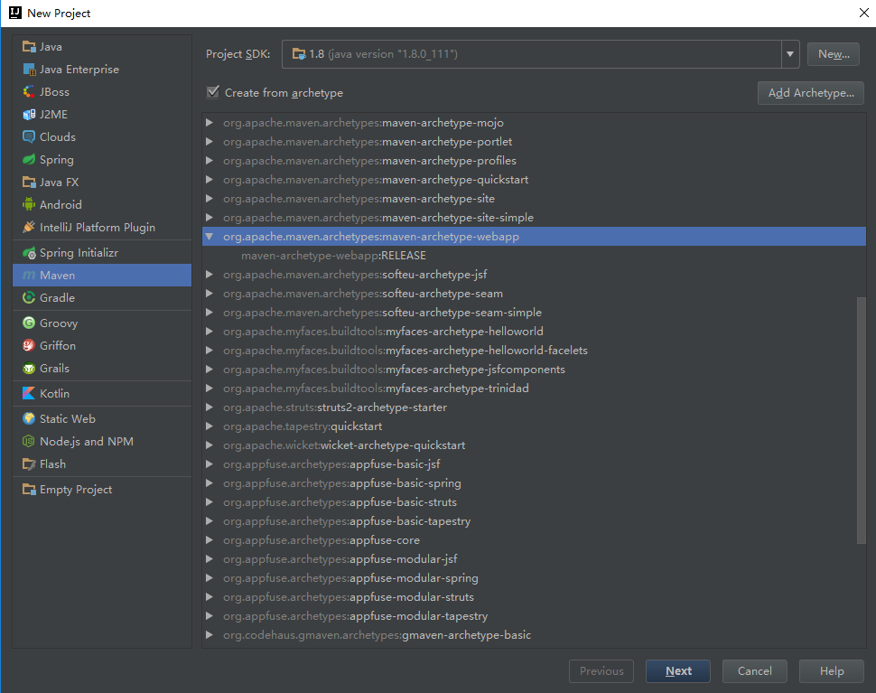
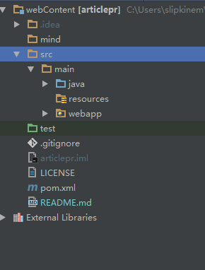

# SSM整合流程
## spring spring-mvc mybatis maven

### IDE idea
1. File => new Project => maven => create from archetype => **maven-archetype-webapp**  

2. 一直点击next直到finished，maven会自动创建一个项目目录  

3. 在创建的POM里面添加依赖
```
<project xmlns="http://maven.apache.org/POM/4.0.0" 
  xmlns:xsi="http://www.w3.org/2001/XMLSchema-instance"
  xsi:schemaLocation="http://maven.apache.org/POM/4.0.0 
  http://maven.apache.org/maven-v4_0_0.xsd">
  <modelVersion>4.0.0</modelVersion>
  <groupId>article</groupId>
  <artifactId>article</artifactId>
  <packaging>war</packaging>
  <version>1.0-SNAPSHOT</version>
  <name>article Maven Webapp</name>
  <url>http://maven.apache.org</url>

  <properties>
    <spring.version>4.2.5.RELEASE</spring.version>
  </properties>

  <dependencies>
    <dependency>
      <groupId>junit</groupId>
      <artifactId>junit</artifactId>
      <version>3.8.1</version>
      <scope>test</scope>
    </dependency>

    <dependency>
      <groupId>org.springframework</groupId>
      <artifactId>spring-core</artifactId>
      <version>${spring.version}</version>
    </dependency>

    <dependency>
      <groupId>org.springframework</groupId>
      <artifactId>spring-context</artifactId>
      <version>${spring.version}</version>
    </dependency>

    <dependency>
      <groupId>mysql</groupId>
      <artifactId>mysql-connector-java</artifactId>
      <version>5.1.38</version>
    </dependency>

    <dependency>
      <groupId>commons-dbcp</groupId>
      <artifactId>commons-dbcp</artifactId>
      <version>1.4</version>
    </dependency>

    <dependency>
      <groupId>jstl</groupId>
      <artifactId>jstl</artifactId>
      <version>1.2</version>
    </dependency>

    <dependency>
      <groupId>com.alibaba</groupId>
      <artifactId>fastjson</artifactId>
      <version>1.2.7</version>
    </dependency>

  </dependencies>

  <build>
    <finalName>article</finalName>
  </build>
</project>
```